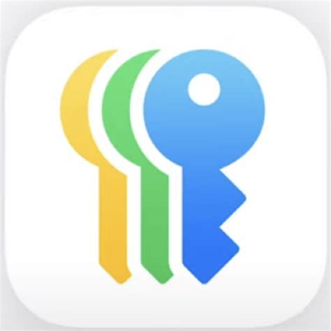
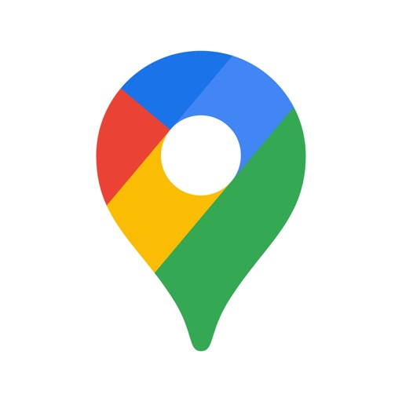
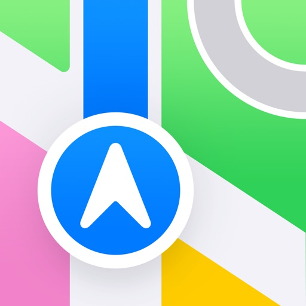
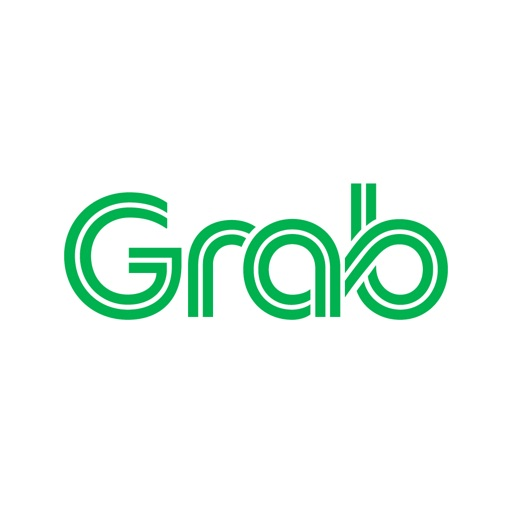
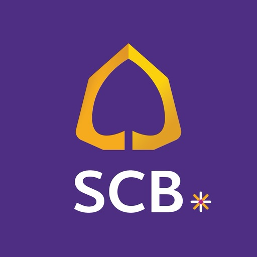
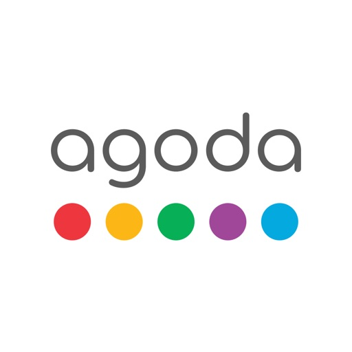
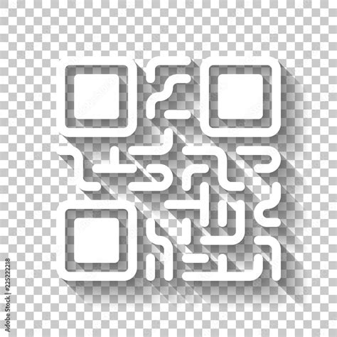
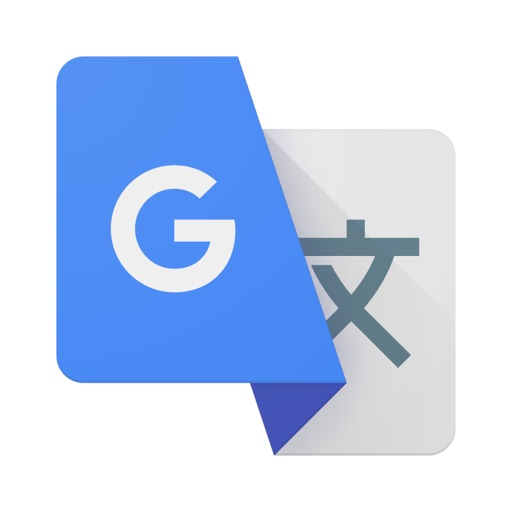

# 🇹🇭 Thailand Essential Apps Guide  

🚕 Transport | 💸 Money | 🍜 Food | 🏠 Housing | 🏥 Healthcare | 💬 Social | 🛒 Shopping | 🧾 Utilities | 🌏 Travel  

A curated guide to the **must-have apps for travelers, expats, and digital nomads in Thailand**.  
Each app includes its **purpose, best use case, hidden tricks, and download links** — so you can get set up quickly and live like a local.  

---

## 🛠 Getting Started — Creating a Thai Store Account  

Some apps in this guide are **only available in the Thai App Store or Google Play Store**.  
To access them, you may need to switch or create a Thai account.  

###  iOS (Apple ID)

1. Open **Settings** → tap your name → **Media & Purchases** → **Sign Out**.  
2. Create a new Apple ID at [appleid.apple.com](https://appleid.apple.com/).  
3. When asked for a region, select **Thailand**.  
4. You’ll need a Thai address — you can use your hotel, condo, or a coworking space.  
5. Once logged in with the Thai Apple ID, you’ll be able to download Thai-only apps.  
   *(Tip: you can switch back to your original Apple ID anytime.)*  

### 🤖 Android (Google Play)  
1. Open the **Google Play Store** app.  
2. Go to **Menu → Account → Country and profiles**.  
3. Select **Thailand** as your country.  
4. Add a Thai payment method (or sometimes just a Thai SIM card).  
5. Once changed, you’ll see Thai-exclusive apps in the Play Store.  
   *(Note: You can only change your Play country once per year, so many expats create a second Gmail account just for Thailand.)*  

---

## 📑 Table of Contents  
- 🚕 [Transport & Navigation](#-transport--navigation)  
- 💸 [Money & Payments](#-money--payments)  
- 🍜 [Food & Groceries](#-food--groceries)  
- 🏠 [Accommodation & Housing](#-accommodation--housing)  
- 🏥 [Healthcare & Wellness](#-healthcare--wellness)  
- 💬 [Communication & Social](#-communication--social)  
- 🛒 [Shopping & Lifestyle](#-shopping--lifestyle)  
- 🧾 [Utilities & Government](#-utilities--government)  
- 🌏 [Travel Extras](#-travel-extras)  
- 💡 [Tips & Tricks](#-tips--tricks)  

---

## 🚕 Transport & Navigation  

###  Google Maps

**Purpose:** Maps & navigation  
**Best Use Case:** Finding routes for walking, driving, or public transport in Thai cities  
**Notable Tricks:**  
- Download offline maps before rural or island trips  
- Search in Thai script for more accurate results  
**Platform:** *iOS | Android | Web*  
**Download:** [App Store](https://apps.apple.com/app/google-maps/id585027354) / [Google Play](https://play.google.com/store/apps/details?id=com.google.android.apps.maps)  

---

###  Apple Maps

**Purpose:** Native iOS map and navigation app  
**Best Use Case:** iPhone users wanting simple navigation with Siri integration  
**Notable Tricks:**  
- Works seamlessly with Apple CarPlay  
- Shows Bangkok BTS/MRT lines with station details  
**Platform:** *iOS | macOS*  
**Download:** [App Store](https://apps.apple.com/app/apple-maps/id915056765)  

---

###  Grab

**Purpose:** Ride-hailing, food delivery, grocery delivery  
**Best Use Case:** Booking taxis or motorbikes, especially when language is a barrier  
**Notable Tricks:**  
- GrabRewards points can be exchanged for discounts  
- Works with most international credit/debit cards  
**Platform:** *iOS | Android*  
**Download:** [App Store](https://apps.apple.com/app/grab/id647268330) / [Google Play](https://play.google.com/store/apps/details?id=com.grabtaxi.passenger)  

---

###  Bolt

**Purpose:** Alternative ride-hailing app, usually cheaper than Grab  
**Best Use Case:** Quick and affordable rides in Bangkok and Chiang Mai  
**Notable Tricks:**  
- Often cheaper than Grab, but availability can be limited late at night  
- Some drivers only accept cash — check before riding  
**Platform:** *iOS | Android*  
**Download:** [App Store](https://apps.apple.com/app/bolt/id675033630) / [Google Play](https://play.google.com/store/apps/details?id=ee.mtakso.client)  

---

###  BTS SkyTrain

**Purpose:** Official Bangkok SkyTrain (BTS) app for routes and fares  
**Best Use Case:** Planning journeys on the BTS network across Bangkok  
**Notable Tricks:**  
- Built-in route planner with fare estimates  
- Station maps include exits and nearby landmarks  
**Platform:** *iOS | Android*  
**Download:** [App Store](https://apps.apple.com/app/bts-skytrain/id606189381) / [Google Play](https://play.google.com/store/apps/details?id=com.btscorporation.btsapp)  

---

###  Bangkok MRT

**Purpose:** Official app for the Bangkok MRT subway system  
**Best Use Case:** Checking train routes, fares, and station info for the Blue and Purple lines  
**Notable Tricks:**  
- Provides updates on service disruptions  
- Station details include park & ride, facilities, and exits  
**Platform:** *iOS | Android*  
**Download:** [App Store](https://apps.apple.com/app/bangkok-mrt/id1059263761) / [Google Play](https://play.google.com/store/apps/details?id=com.bem.mrtapp)  

---

## 💸 Money & Payments  

###  TrueMoney Wallet

**Purpose:** Digital wallet for QR payments, transfers, and bills  
**Best Use Case:** Paying at 7-Eleven, street vendors, and online shopping  
**Notable Tricks:**  
- Works widely where PromptPay is accepted  
- Easy top-up with Thai bank or cash at 7-Eleven  
**Platform:** *iOS | Android*  
**Download:** [App Store](https://apps.apple.com/app/truemoney-wallet/id568388474) / [Google Play](https://play.google.com/store/apps/details?id=mm.com.truemoney.wallet)  

---

###  Moreta Pay

**Purpose:** Mobile wallet and payments platform growing in Thailand  
**Best Use Case:** Paying at participating merchants, especially in Chiang Mai and partner locations  
**Notable Tricks:**  
- Supports local promos and cashback offers  
- Works well for smaller shops adopting digital payments  
**Platform:** *iOS | Android*  
**Download:** [App Store](https://apps.apple.com/th/app/moreta-pay/id6451324675) / [Google Play](https://play.google.com/store/apps/details?id=com.moreta.pay)  

---

###  Wise

**Purpose:** International transfers and currency exchange  
**Best Use Case:** Sending money to Thailand or paying in THB with low fees  
**Notable Tricks:**  
- Multi-currency account with THB wallet  
- Great exchange rates compared to banks  
**Platform:** *iOS | Android | Web*  
**Download:** [App Store](https://apps.apple.com/app/wise/id612261027) / [Google Play](https://play.google.com/store/apps/details?id=com.transferwise.android)  

---

###  Revolut

**Purpose:** Multi-currency banking app  
**Best Use Case:** Using foreign cards in Thailand with minimal FX fees  
**Notable Tricks:**  
- Create virtual cards for secure online shopping  
- Works with Apple Pay / Google Pay in Thailand  
**Platform:** *iOS | Android | Web*  
**Download:** [App Store](https://apps.apple.com/app/revolut/id932493382) / [Google Play](https://play.google.com/store/apps/details?id=com.revolut.revolut)  

---

## 🍜 Food & Groceries  

###  GrabFood

**Purpose:** Food delivery from restaurants, cafes, and convenience stores  
**Best Use Case:** Ordering meals in major Thai cities when you want the widest selection  
**Notable Tricks:**  
- Integrated with Grab app (rides + food + groceries)  
- GrabRewards points can be exchanged for food discounts  
**Platform:** *iOS | Android*  
**Download:** [App Store](https://apps.apple.com/app/grab/id647268330) / [Google Play](https://play.google.com/store/apps/details?id=com.grabtaxi.passenger)  

---

###  LINE MAN Wongnai

**Purpose:** Food delivery and restaurant discovery  
**Best Use Case:** Finding local eateries not listed on Grab or Foodpanda  
**Notable Tricks:**  
- Integrated with Wongnai reviews for trusted ratings  
- Often has lower delivery fees in central Bangkok  
**Platform:** *iOS | Android*  
**Download:** [App Store](https://apps.apple.com/th/app/line-man-wongnai/id1071609634) / [Google Play](https://play.google.com/store/apps/details?id=com.linecorp.linemanth&hl=en)  

---

###  Makro PRO

**Purpose:** Wholesale grocery ordering and delivery for businesses (B2B focus)  
**Best Use Case:** Stocking up on bulk groceries, supplies, and household items for restaurants, hotels, or retail  
**Notable Tricks:**  
- Offers next-day delivery — great for bulk restock needs  
- PRO Points system gives cashback rewards on purchases  
**Platform:** *iOS | Android | Web*  
**Download:** [App Store](https://apps.apple.com/us/app/makropro-9-9-super-deals/id1570380497) / [Google Play](https://play.google.com/store/apps/details?id=com.makromangoapp.production)  

---

## 🏠 Accommodation & Housing  

###  Airbnb

**Purpose:** Short-term and monthly rental platform  
**Best Use Case:** Booking apartments, condos, or villas directly from hosts  
**Notable Tricks:**  
- Use “Monthly stay” filter for big discounts on long-term rentals  
- Many listings include utilities and internet, ideal for digital nomads  
**Platform:** *iOS | Android | Web*  
**Download:** [App Store](https://apps.apple.com/app/airbnb/id401626263) / [Google Play](https://play.google.com/store/apps/details?id=com.airbnb.android)  

---

###  Agoda

**Purpose:** Hotel and accommodation booking with strong presence in Asia  
**Best Use Case:** Finding deals on hotels, resorts, and guesthouses in Thailand  
**Notable Tricks:**  
- “AgodaCash” loyalty system gives discounts on future bookings  
- Prices often lower than Booking.com for Thai hotels  
**Platform:** *iOS | Android | Web*  
**Download:** [App Store](https://apps.apple.com/app/agoda/id440676901) / [Google Play](https://play.google.com/store/apps/details?id=com.agoda.mobile.consumer)  

---

###  Booking.com

**Purpose:** Global hotel and accommodation booking platform  
**Best Use Case:** Booking hotels with flexible cancellation policies  
**Notable Tricks:**  
- Genius loyalty program unlocks discounts and perks  
- Many properties allow free cancellation until the day before check-in  
**Platform:** *iOS | Android | Web*  
**Download:** [App Store](https://apps.apple.com/app/booking-com-hotels-travel/id367003839) / [Google Play](https://play.google.com/store/apps/details?id=com.booking)  

---

## 🏥 Healthcare & Wellness  

###  Doctor A to Z

**Purpose:** Telemedicine app to book doctors and consult online  
**Best Use Case:** When you need a quick consultation or prescription without visiting a hospital  
**Notable Tricks:**  
- Supports direct payment via Thai banks or credit card  
- Medicine delivery service available in major cities  
**Platform:** *iOS | Android | Web*  
**Download:** [App Store](https://apps.apple.com/th/app/doctor-a-to-z/id1147257394) / [Google Play](https://play.google.com/store/apps/details?id=com.doctoratoz.patient)  

---

###  MorDee (หมอดี)

**Purpose:** Online medical consultation and prescription app  
**Best Use Case:** Talking to Thai doctors remotely for minor issues, refills, or advice  
**Notable Tricks:**  
- Provides e-prescriptions you can use at pharmacies  
- Offers mental health and wellness consultations as well  
**Platform:** *iOS | Android*  
**Download:** [App Store](https://apps.apple.com/th/app/mordee/id1507517592) / [Google Play](https://play.google.com/store/apps/details?id=com.truehealth.doctor)  

---

## 💬 Communication & Social  

###  LINE

**Purpose:** Thailand’s #1 messaging app for chats, calls, and payments  
**Best Use Case:** Staying in touch with locals, paying via QR codes, joining community groups  
**Notable Tricks:**  
- Add official accounts for banks, shops, and even government services  
- Use LINE Pay for payments and discounts  
**Platform:** *iOS | Android | Web*  
**Download:** [App Store](https://apps.apple.com/app/line/id443904275) / [Google Play](https://play.google.com/store/apps/details?id=jp.naver.line.android)  

---

###  Messenger

**Purpose:** Facebook’s messaging platform  
**Best Use Case:** Communicating with Thai friends and businesses that use Facebook Pages  
**Notable Tricks:**  
- Many small shops in Thailand only reply via Facebook + Messenger  
- Integrated with Facebook Marketplace for buying/selling  
**Platform:** *iOS | Android | Web*  
**Download:** [App Store](https://apps.apple.com/app/messenger/id454638411) / [Google Play](https://play.google.com/store/apps/details?id=com.facebook.orca)  

---

###  WhatsApp

**Purpose:** Global messaging app  
**Best Use Case:** Staying connected with friends and family abroad  
**Notable Tricks:**  
- End-to-end encrypted calls and messages  
- Works with international numbers when switching SIM cards  
**Platform:** *iOS | Android | Web*  
**Download:** [App Store](https://apps.apple.com/app/whatsapp-messenger/id310633997) / [Google Play](https://play.google.com/store/apps/details?id=com.whatsapp)  

---

## 🛒 Shopping & Lifestyle  

###  Shopee

**Purpose:** Thailand’s largest e-commerce marketplace  
**Best Use Case:** Buying cheap goods, fashion, gadgets, and home items with daily vouchers  
**Notable Tricks:**  
- Daily “Shopee Coins” and voucher codes reduce prices  
- Integrated chat to negotiate with sellers  
**Platform:** *iOS | Android | Web*  
**Download:** [App Store](https://apps.apple.com/app/shopee-th/id959841449) / [Google Play](https://play.google.com/store/apps/details?id=com.shopee.th)  

---

###  Lazada

**Purpose:** Major e-commerce app with wide product range and official brand stores  
**Best Use Case:** Electronics, appliances, and products where you want authenticity guaranteed  
**Notable Tricks:**  
- LazMall section offers authentic products with fast delivery  
- Frequent 11.11, 12.12, and payday mega sales  
- You can pay your electricity, water, and mobile bills directly in the app using foreign credit cards
**Platform:** *iOS | Android | Web*  
**Download:** [App Store](https://apps.apple.com/app/lazada-th/id785385147) / [Google Play](https://play.google.com/store/apps/details?id=com.lazada.android)  

---

###  JD Central

**Purpose:** Online shopping app for genuine goods and electronics  
**Best Use Case:** Buying appliances, electronics, and products with reliability  
**Notable Tricks:**  
- Strong focus on authentic, guaranteed goods  
- Often runs flash sales on home appliances  
**Platform:** *iOS | Android | Web*  
**Download:** [App Store](https://apps.apple.com/th/app/jd-central/id1330536091) / [Google Play](https://play.google.com/store/apps/details?id=com.jd.jdlite.th)  

---

## 🧾 Utilities & Government  

###  MEA Smart Life

**Purpose:** Manage electricity bills in Bangkok (Metropolitan Electricity Authority)  
**Best Use Case:** Paying and tracking monthly electricity bills if you live in Bangkok  
**Notable Tricks:**  
- Supports QR PromptPay for fast payments  
- Can view past consumption history  
**Platform:** *iOS | Android*  
**Download:** [App Store](https://apps.apple.com/th/app/mea-smart-life/id1465462176) / [Google Play](https://play.google.com/store/apps/details?id=th.co.mea.meaapp)  

---

###  PEA Smart Plus

**Purpose:** Manage electricity bills outside Bangkok (Provincial Electricity Authority)  
**Best Use Case:** Paying electricity bills for condos or houses in provincial areas  
**Notable Tricks:**  
- Receive bill notifications directly on the app  
- Multiple account support (handy for landlords)  
**Platform:** *iOS | Android*  
**Download:** [App Store](https://apps.apple.com/th/app/pea-smart-plus/id1330554881) / [Google Play](https://play.google.com/store/apps/details?id=th.co.pea.smartapp)  

---

###  MWA onMobile

**Purpose:** Manage Bangkok water supply bills  
**Best Use Case:** Paying and tracking water bills in Bangkok condos and houses  
**Notable Tricks:**  
- Quick scan of bills with QR code  
- Bill alerts for due dates  
**Platform:** *iOS | Android*  
**Download:** [App Store](https://apps.apple.com/th/app/mwa-onmobile/id1003395142) / [Google Play](https://play.google.com/store/apps/details?id=th.or.mwa.onmobile)  

---

###  DLT QR Licence

**Purpose:** Digital Thai driving licence app by the Department of Land Transport  
**Best Use Case:** Carrying a valid digital driver’s license instead of the plastic card  
**Notable Tricks:**  
- Shows license details and expiry  
- Can display traffic tickets and points  
**Platform:** *iOS | Android*  
**Download:** [App Store](https://apps.apple.com/th/app/dlt-qr-licence/id1437586225) / [Google Play](https://play.google.com/store/apps/details?id=th.go.dlt.smartlicence)  

---

## 🌏 Travel Extras  

###  Google Translate

**Purpose:** Translation app for Thai ↔ English (and more)  
**Best Use Case:** Communicating with locals when language barrier appears  
**Notable Tricks:**  
- Download Thai language pack for offline translation  
- Instant camera translation for menus and signs  
**Platform:** *iOS | Android | Web*  
**Download:** [App Store](https://apps.apple.com/app/google-translate/id414706506) / [Google Play](https://play.google.com/store/apps/details?id=com.google.android.apps.translate)  

---

###  Apple Translate

**Purpose:** Apple’s native translation app  
**Best Use Case:** Quick translations on iPhone, especially with Siri integration  
**Notable Tricks:**  
- Works system-wide with text selection and Safari  
- Supports offline mode for Thai and other languages  
**Platform:** *iOS | iPadOS | macOS*  
**Download:** [App Store](https://apps.apple.com/app/translate/id1514592288)  

---

## 💡 Tips & Tricks  

- Switch App Store / Google Play region to Thailand for full features  
- Use QR payments (PromptPay) everywhere — even street food  
- Download offline maps & translations before rural trips  
- Some apps require Thai phone number & ID — plan ahead  

---

## 📜 License  
This project is licensed under the [MIT License](LICENSE).  
You’re free to use, share, and adapt with attribution.  

---

## ✨ Credits  
Created and maintained by [@jdelaire](https://github.com/jdelaire).  
Special focus on tools and apps that make life easier for **expats, digital nomads, and travelers in Thailand**.  