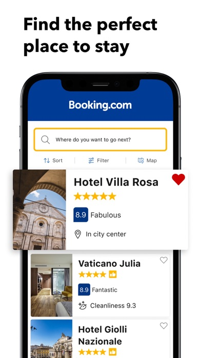
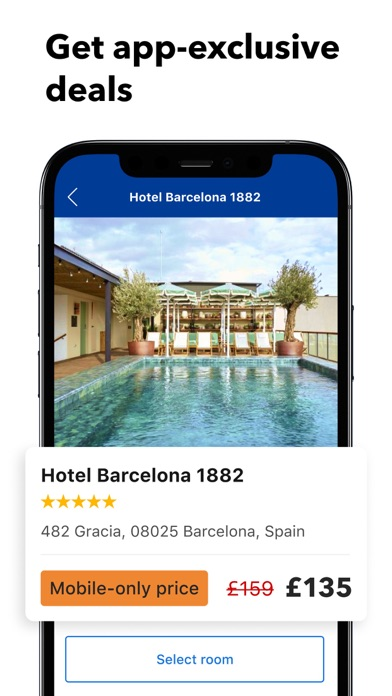

# 🏠 Accommodation & Housing

Essential apps for finding and booking accommodation in Thailand.

## Airbnb

<h3 class="app-title">Airbnb</h3>

**Purpose:** Short-term and monthly rental platform  
**Best Use Case:** Booking apartments, condos, or villas directly from hosts  
**Available outside of Thai stores?** ✅  
**Foreign Credit Cards accepted?** ✅  
**Notable Tricks:**  
- Use "Monthly stay" filter for big discounts on long-term rentals  
- Many listings include utilities and internet, ideal for digital nomads  
**Platform:** *iOS | Android | Web*  
**Download:** [App Store](https://apps.apple.com/th/app/airbnb/id401626263){:target="_blank"} / [Google Play](https://play.google.com/store/apps/details?id=com.airbnb.android){:target="_blank"}

---

## Agoda

<h3 class="app-title">Agoda</h3>

**Purpose:** Hotel and accommodation booking with strong presence in Asia  
**Best Use Case:** Finding deals on hotels, resorts, and guesthouses in Thailand  
**Available outside of Thai stores?** ✅  
**Foreign Credit Cards accepted?** ✅  
**Notable Tricks:**  
- "AgodaCash" loyalty system gives discounts on future bookings  
- Prices often lower than Booking.com for Thai hotels  
**Platform:** *iOS | Android | Web*  
**Download:** [App Store](https://apps.apple.com/th/app/agoda/id440676901){:target="_blank"} / [Google Play](https://play.google.com/store/apps/details?id=com.agoda.mobile.consumer){:target="_blank"}

---

## Booking.com

<h3 class="app-title">Booking.com</h3>

**Purpose:** Global hotel and accommodation booking platform  
**Best Use Case:** Booking hotels with flexible cancellation policies  
**Available outside of Thai stores?** ✅  
**Foreign Credit Cards accepted?** ✅  
**Notable Tricks:**  
- Genius loyalty program unlocks discounts and perks  
- Many properties allow free cancellation until the day before check-in  
**Platform:** *iOS | Android | Web*  
**Download:** [App Store](https://apps.apple.com/th/app/booking-com-hotels-travel/id367003839){:target="_blank"} / [Google Play](https://play.google.com/store/apps/details?id=com.booking){:target="_blank"}

