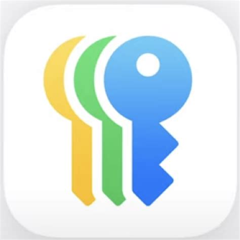

# 🇹🇭 Thailand Essential Apps Guide  

A curated guide to the **must-have apps for travelers, expats, and digital nomads in Thailand**.  
Each app includes its **purpose, best use case, hidden tricks, and download links** — so you can get set up quickly and live like a local.  

---

## 🛠 Getting Started — Creating a Thai Store Account  

Some apps in this guide are **only available in the Thai App Store or Google Play Store**.  
To access them, you may need to switch or create a Thai account.  

###  iOS (Apple ID)

1. Open **Settings** → tap your name → **Media & Purchases** → **Sign Out**.  
2. Create a new Apple ID at [appleid.apple.com](https://appleid.apple.com/){:target="_blank"}.  
3. When asked for a region, select **Thailand**.  
4. You'll need a Thai address — you can use your hotel, condo, or a coworking space.  
5. Once logged in with the Thai Apple ID, you'll be able to download Thai-only apps.  
   *(Tip: you can switch back to your original Apple ID anytime.)*  

### 🤖 Android (Google Play)  
1. Open the **Google Play Store** app.  
2. Go to **Menu → Account → Country and profiles**.  
3. Select **Thailand** as your country.  
4. Add a Thai payment method (or sometimes just a Thai SIM card).  
5. Once changed, you'll see Thai-exclusive apps in the Play Store.  
   *(Note: You can only change your Play country once per year, so many expats create a second Gmail account just for Thailand.)*  

---

## 📑 Quick Navigation  

Use the navigation menu on the left to jump to specific categories:

- 🚕 **[Transport & Navigation](transport)** - Getting around Thailand
- 💸 **[Money & Payments](money)** - Managing finances and payments  
- 🍜 **[Food & Groceries](food)** - Food delivery and grocery shopping
- 🏠 **[Accommodation & Housing](housing)** - Finding places to stay
- 💬 **[Communication & Social](social)** - Staying connected
- 🛒 **[Shopping & Lifestyle](shopping)** - Online shopping and lifestyle

---

## 💡 Tips & Tricks  

- Switch App Store / Google Play region to Thailand for full features  
- Use QR payments (PromptPay) everywhere — even street food  
- Download offline maps & translations before rural trips  
- Some apps require Thai phone number & ID — plan ahead  

---

## 📜 License  
This project is licensed under the [MIT License](LICENSE).  
You're free to use, share, and adapt with attribution.  

---

## ✨ Credits  
Created and maintained by [@jdelaire](https://github.com/jdelaire).  
Special focus on tools and apps that make life easier for **expats, digital nomads, and travelers in Thailand**.