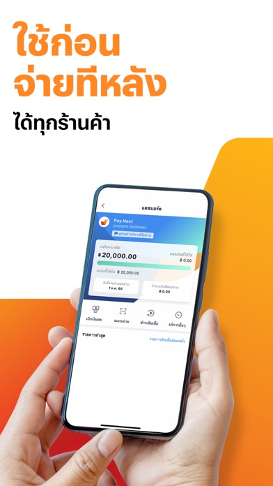
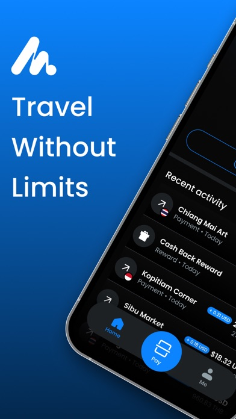
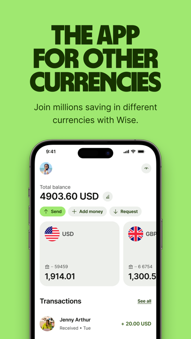
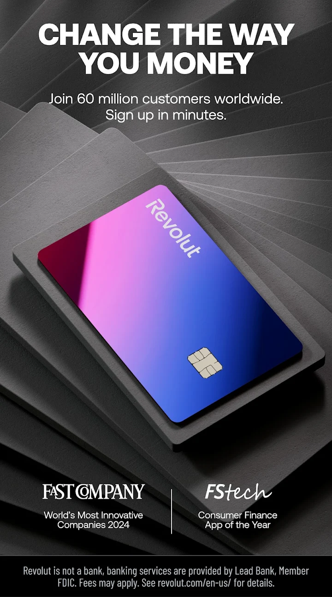

# 💸 Money & Payments

Essential apps for managing money and making payments in Thailand.

## TrueMoney Wallet

<h3 class="app-title">TrueMoney Wallet</h3>

**Purpose:** Digital wallet for QR payments, transfers, and bills  
**Best Use Case:** Paying at 7-Eleven, street vendors, and online shopping  
**Available on Thai Store only:** ✅  
**Foreign Credit Cards accepted?** ❌ (Requires Thai bank account or cash top-up)  
**Notable Tricks:**  
- Works widely where PromptPay is accepted  
- Easy top-up with Thai bank or cash at 7-Eleven  
**Platform:** *iOS | Android*  
**Download:** [App Store](https://apps.apple.com/us/app/truemoney-pay-earn-coins/id663885752){:target="_blank"} / [Google Play](https://play.google.com/store/apps/details?id=th.co.truemoney.wallet){:target="_blank"}

---

## Moreta Pay

<h3 class="app-title">Moreta Pay</h3>

**Purpose:** QR payment app for travelers across Southeast Asia  
**Best Use Case:** Paying with QR codes in Thailand, Vietnam, Philippines, Cambodia, Laos, and Mongolia using foreign bank accounts  
**Available on Thai Store only:** ❌  
**Foreign Credit Cards accepted?** ✅ (Top-up with US, EU, UK banks or international cards)  
**Notable Tricks:**  
- 1% cashback with zero fees  
- Works with USD bank accounts and international Visa/Mastercard  
- No cash exchanges or ATM runs needed  
**Platform:** *iOS | Android*  
**Download:** [App Store](https://apps.apple.com/us/app/moreta-pay/id6590609636){:target="_blank"} / [Google Play](https://play.google.com/store/apps/details?id=com.moreta.moretamobile){:target="_blank"}

---

## Wise

<h3 class="app-title">Wise</h3>

**Purpose:** International transfers and currency exchange  
**Best Use Case:** Sending money to Thailand or paying in THB with low fees  
**Available on Thai Store only:** ❌  
**Foreign Credit Cards accepted?** ✅  
**Notable Tricks:**  
- Multi-currency account with THB wallet  
- Great exchange rates compared to banks  
**Platform:** *iOS | Android | Web*  
**Download:** [App Store](https://apps.apple.com/app/wise/id612261027){:target="_blank"} / [Google Play](https://play.google.com/store/apps/details?id=com.transferwise.android){:target="_blank"}

---

## Revolut

<h3 class="app-title">Revolut</h3>

**Purpose:** Multi-currency banking app  
**Best Use Case:** Using foreign cards in Thailand with minimal FX fees  
**Available on Thai Store only:** ❌  
**Foreign Credit Cards accepted?** ✅  
**Notable Tricks:**  
- Create virtual cards for secure online shopping  
- Works with Apple Pay / Google Pay in Thailand  
**Platform:** *iOS | Android | Web*  
**Download:** [App Store](https://apps.apple.com/app/revolut/id932493382){:target="_blank"} / [Google Play](https://play.google.com/store/apps/details?id=com.revolut.revolut){:target="_blank"}

