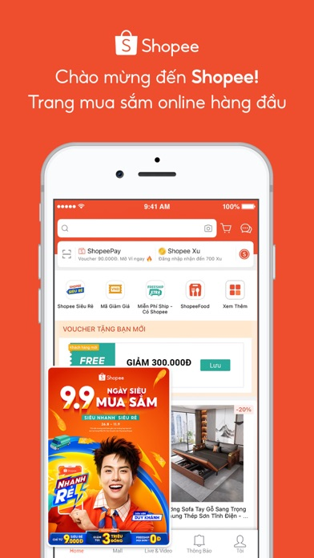
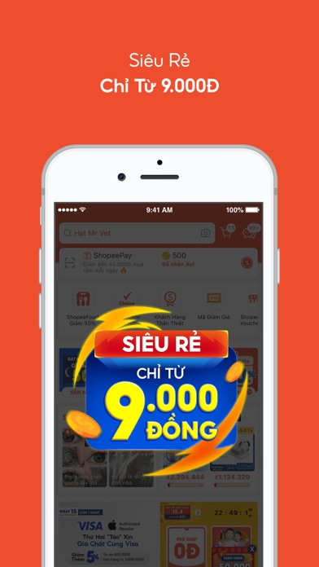
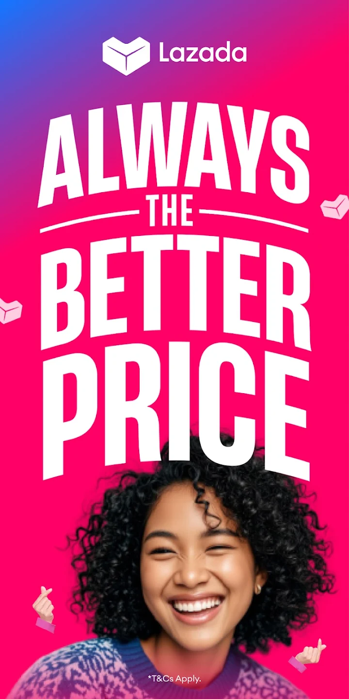

# 🛒 Shopping & Lifestyle

Essential apps for shopping and lifestyle needs in Thailand.

## Shopee

<h3 class="app-title">Shopee</h3>

**Purpose:** Thailand's largest e-commerce marketplace  
**Best Use Case:** Buying cheap goods, fashion, gadgets, and home items with daily vouchers  
**Available outside of Thai stores?** ✅  
**Foreign Credit Cards accepted?** ✅  
**Notable Tricks:**  
- Daily "Shopee Coins" and voucher codes reduce prices  
- Integrated chat to negotiate with sellers  
**Platform:** *iOS | Android | Web*  
**Download:** [App Store](https://apps.apple.com/th/app/shopee-th/id959841449){:target="_blank"} / [Google Play](https://play.google.com/store/apps/details?id=com.shopee.th){:target="_blank"}

---

## Lazada

<h3 class="app-title">Lazada</h3>

**Purpose:** Major e-commerce app with wide product range and official brand stores  
**Best Use Case:** Electronics, appliances, and products where you want authenticity guaranteed  
**Available outside of Thai stores?** ✅  
**Foreign Credit Cards accepted?** ✅  
**Notable Tricks:**  
- LazMall section offers authentic products with fast delivery  
- Frequent 11.11, 12.12, and payday mega sales  
- You can pay your electricity, water, and mobile bills directly in the app using foreign credit cards
**Platform:** *iOS | Android | Web*  
**Download:** [App Store](https://apps.apple.com/th/app/lazada-th/id785385147){:target="_blank"} / [Google Play](https://play.google.com/store/apps/details?id=com.lazada.android){:target="_blank"}

