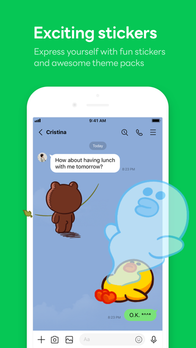
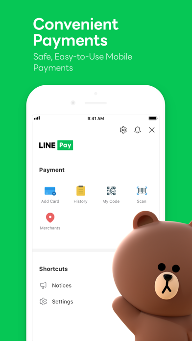
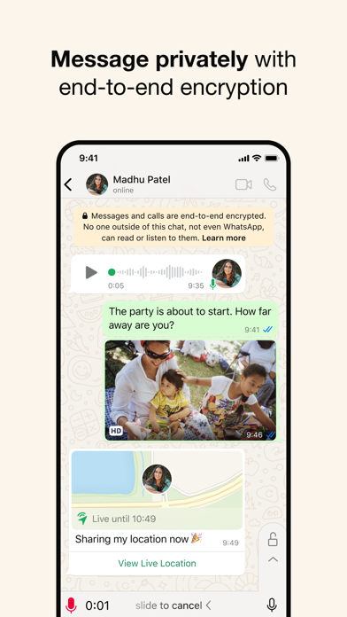
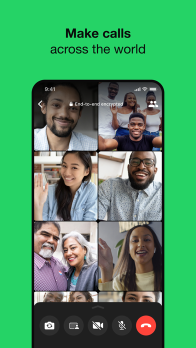

# 💬 Communication & Social

Essential apps for staying connected and communicating in Thailand.

## LINE

<h3 class="app-title">LINE</h3>

**Purpose:** Thailand's #1 messaging app for chats, calls, and payments  
**Best Use Case:** Staying in touch with locals, paying via QR codes, joining community groups  
**Available on Thai Store only:** ❌  
**Foreign Credit Cards accepted?** ✅  
**Notable Tricks:**  
- Add official accounts for banks, shops, and even government services  
- Use LINE Pay for payments and discounts  
**Platform:** *iOS | Android | Web*  
**Download:** [App Store](https://apps.apple.com/th/app/line/id443904275){:target="_blank"} / [Google Play](https://play.google.com/store/apps/details?id=jp.naver.line.android){:target="_blank"}

---

## Messenger

<h3 class="app-title">Messenger</h3>

**Purpose:** Facebook's messaging platform  
**Best Use Case:** Communicating with Thai friends and businesses that use Facebook Pages  
**Available on Thai Store only:** ❌  
**Foreign Credit Cards accepted?** ✅  
**Notable Tricks:**  
- Many small shops in Thailand only reply via Facebook + Messenger  
- Integrated with Facebook Marketplace for buying/selling  
**Platform:** *iOS | Android | Web*  
**Download:** [App Store](https://apps.apple.com/th/app/messenger/id454638411){:target="_blank"} / [Google Play](https://play.google.com/store/apps/details?id=com.facebook.orca){:target="_blank"}

---

## WhatsApp

<h3 class="app-title">WhatsApp</h3>

**Purpose:** Global messaging app  
**Best Use Case:** Staying connected with friends and family abroad  
**Available on Thai Store only:** ❌  
**Foreign Credit Cards accepted?** ✅  
**Notable Tricks:**  
- End-to-end encrypted calls and messages  
- Works with international numbers when switching SIM cards  
**Platform:** *iOS | Android | Web*  
**Download:** [App Store](https://apps.apple.com/th/app/whatsapp-messenger/id310633997){:target="_blank"} / [Google Play](https://play.google.com/store/apps/details?id=com.whatsapp){:target="_blank"}

