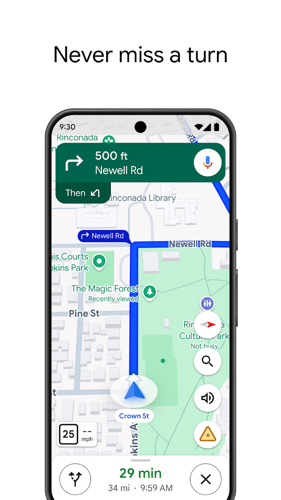
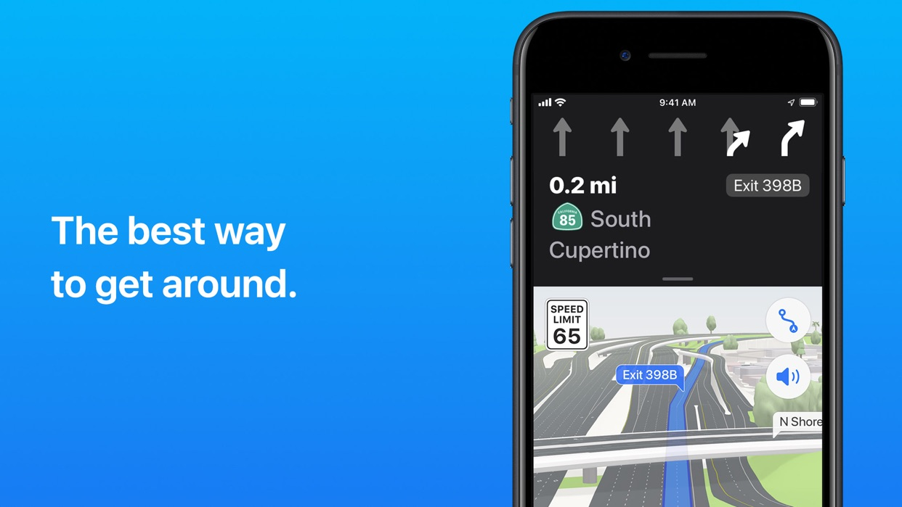
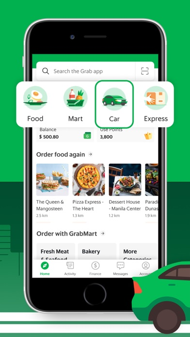
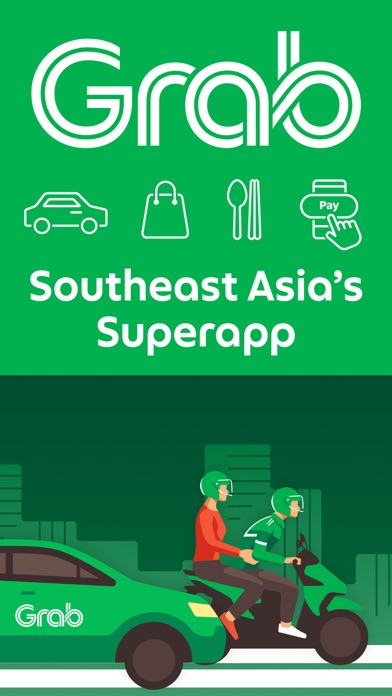
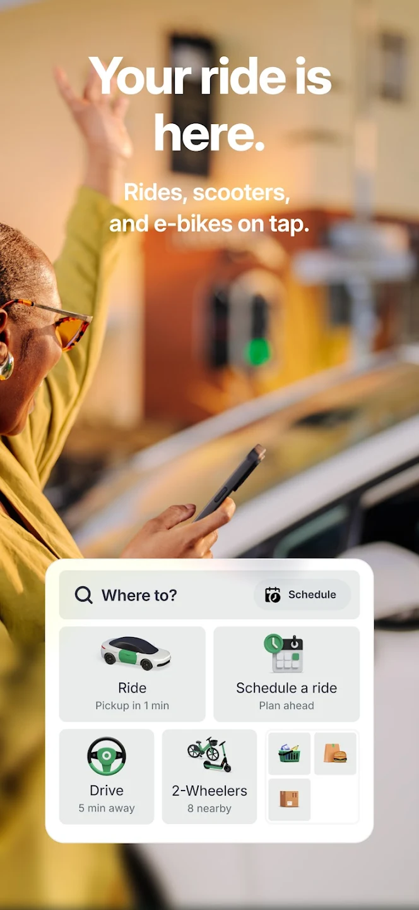
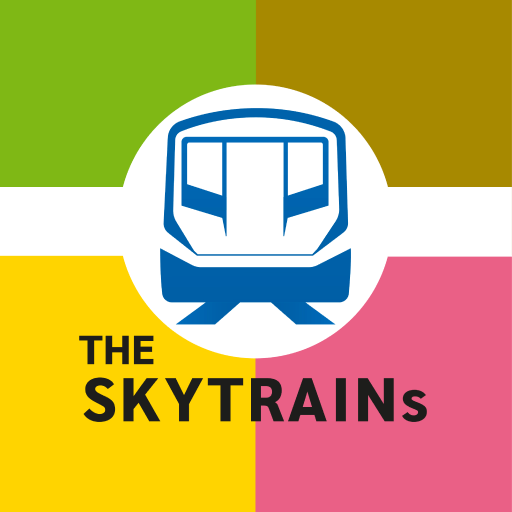

# 🚕 Transport & Navigation

Essential apps for getting around Thailand efficiently.

## Google Maps

<h3 class="app-title">Google Maps</h3>

**Purpose:** Maps & navigation  
**Best Use Case:** Finding routes for walking, driving, or public transport in Thai cities  
**Available outside of Thai stores?** ✅  
**Foreign Credit Cards accepted?** ✅  
**Notable Tricks:**  
- Download offline maps before rural or island trips  
- Search in Thai script for more accurate results  
**Platform:** *iOS | Android | Web*  
**Download:** [App Store](https://apps.apple.com/app/google-maps/id585027354){:target="_blank"} / [Google Play](https://play.google.com/store/apps/details?id=com.google.android.apps.maps){:target="_blank"}

---

## Apple Maps

<h3 class="app-title">Apple Maps</h3>

**Purpose:** Native iOS map and navigation app  
**Best Use Case:** iPhone users wanting simple navigation with Siri integration  
**Available outside of Thai stores?** ✅  
**Foreign Credit Cards accepted?** ✅  
**Notable Tricks:**  
- Works seamlessly with Apple CarPlay  
- Shows Bangkok BTS/MRT lines with station details  
**Platform:** *iOS | macOS*  
**Download:** [App Store](https://apps.apple.com/app/apple-maps/id915056765){:target="_blank"}

---

## Grab

<h3 class="app-title">Grab</h3>

**Purpose:** Ride-hailing, food delivery, grocery delivery  
**Best Use Case:** Booking taxis or motorbikes, especially when language is a barrier  
**Available outside of Thai stores?** ✅  
**Foreign Credit Cards accepted?** ✅  
**Notable Tricks:**  
- GrabRewards points can be exchanged for discounts  
- Works with most international credit/debit cards  
**Platform:** *iOS | Android*  
**Download:** [App Store](https://apps.apple.com/app/grab/id647268330){:target="_blank"} / [Google Play](https://play.google.com/store/apps/details?id=com.grabtaxi.passenger){:target="_blank"}

---

## Bolt

<h3 class="app-title">Bolt</h3>

**Purpose:** Alternative ride-hailing app, usually cheaper than Grab  
**Best Use Case:** Quick and affordable rides in Bangkok and Chiang Mai  
**Available outside of Thai stores?** ✅  
**Foreign Credit Cards accepted?** ✅  
**Notable Tricks:**  
- Often cheaper than Grab, but availability can be limited late at night  
- Some drivers only accept cash — check before riding  
**Platform:** *iOS | Android*  
**Download:** [App Store](https://apps.apple.com/app/bolt/id675033630){:target="_blank"} / [Google Play](https://play.google.com/store/apps/details?id=ee.mtakso.client){:target="_blank"}

---

## BTS SkyTrain

<h3 class="app-title">BTS SkyTrain</h3>

**Purpose:** Official Bangkok SkyTrain (BTS) app for routes and fares  
**Best Use Case:** Planning journeys on the BTS network across Bangkok  
**Available outside of Thai stores?** ❌  
**Foreign Credit Cards accepted?** ℹ️ (Free app)  
**Notable Tricks:**  
- Built-in route planner with fare estimates  
- Station maps include exits and nearby landmarks  
**Platform:** *iOS | Android*  
**Download:** [App Store](https://apps.apple.com/th/app/bts-skytrain/id606189381){:target="_blank"} / [Google Play](https://play.google.com/store/apps/details?id=th.btsc.theskytrains){:target="_blank"}

---

## Bangkok MRT

<h3 class="app-title">Bangkok MRT</h3>

**Purpose:** Official app for the Bangkok MRT subway system  
**Best Use Case:** Checking train routes, fares, and station info for the Blue and Purple lines  
**Available outside of Thai stores?** ❌  
**Foreign Credit Cards accepted?** ℹ️ (Free app)  
**Notable Tricks:**  
- Provides updates on service disruptions  
- Station details include park & ride, facilities, and exits  
**Platform:** *iOS | Android*  
**Download:** [App Store](https://apps.apple.com/th/app/bangkok-mrt/id1059263761){:target="_blank"} / [Google Play](https://play.google.com/store/apps/details?id=com.devsenses.mrt_app){:target="_blank"}

